# Detection Flow

End-to-end pipeline from raw microphone audio through all filters to database persistence.

---

## Flow Diagram

```mermaid
flowchart TD
    A([Microphone\nsounddevice.rec]) --> B[_record_thread\nhop-length chunk]

    B --> C[(CaptureBuffer\ncontinuous ring buffer\ndefault 30 s)]
    B --> D[audio_queue\n1-s chunks]

    D --> E[Accumulate rolling window\n3 s — BirdNET\n5 s — Perch]

    E --> F{High-pass filter\nenabled?}
    F -->|yes| G[apply_highpass\nButterworth copy\ndefault 150 Hz order 5]
    F -->|no| H[raw audio used]
    G --> I[model.run_inference]
    H --> I

    I --> J{Inference model}
    J -->|birdnet| K[Write temp WAV\nbirdnet_analyzer.analyze\nparse CSV results]
    J -->|perch| L[Resample to 32 kHz\nembed → softmax\nmap sci name → common name]
    K --> M[list of name + confidence\nnoise labels stripped\nraw floor 0.01]
    L --> M

    M --> N[Global exclude list\ncfg.exclude\nexact IOC names]
    N --> O[Min confidence filter\ndefaults.min_confidence\nper-species override if set]
    O --> P[BOU allowlist filter\nUK species only\nalways active]
    P --> Q{Seasonal filter\nenabled?}
    Q -->|yes| R[SeasonalFilter.check\nISO week vs GBIF data\nuk_seasonal_filter.json]
    Q -->|no| S
    R --> S{Nocturnal filter\nenabled?}
    S -->|yes| T[NocturnalFilter.check\nsunrise/sunset or fixed window\nastral + uk_nocturnal_filter.json]
    S -->|no| U
    T --> U[Confirmation filter\n_pending dict\nrequires N hits in window]

    U --> V{hit_count >=\nmin_detections?}
    V -->|no| W[Log pending N/M\nwait for next window]
    V -->|yes| X[Cooldown check\n_last_detected dict]

    X --> Y{Within cooldown\nwindow?}
    Y -->|yes| Z[Discard — too recent]
    Y -->|no| AA[Submit _deferred_save\nto thread pool executor]

    AA --> BB[CaptureBuffer.read_segment\nextract pre + window + post slice]
    C --> BB

    BB --> CC{Cross-validation\nenabled?}
    CC -->|yes| DD[Secondary model\nrun_inference on cv_audio]
    DD --> EE{Primary conf >=\nskip_threshold?}
    EE -->|yes| GG[Skip CV\nhigh-confidence shortcut]
    EE -->|no| FF{Models agree\non species?}
    FF -->|drop| HH[Discard — no I/O]
    FF -->|flag| II[Mark flagged = true\ncontinue to save]
    FF -->|agree| JJ[Confidence = mean\nof both models]

    CC -->|no| KK
    GG --> KK
    II --> KK
    JJ --> KK

    KK[save_clip\npeak-normalise to int16\nwrite FLAC to detections/]
    KK --> LL[record_detection\nINSERT INTO detections\nSQLite or PostgreSQL]

    LL --> MM[publish_detection\noptional MQTT]
    LL --> NN[birdmap.post_detection\noptional birdmap.co.uk]
```



---

## Stage-by-Stage Description

### 1. Audio Capture

**Files:** `detector.py` → `_record_thread`, `audio.py`

The recording thread runs continuously in a daemon thread, calling `sounddevice.rec()` with a short hop length (default 1 second at 48 kHz = 48,000 int16 samples). Each chunk is written to two consumers in parallel:

- **`CaptureBuffer`** — a large ring buffer (default 30 s) that holds a continuous rolling window of raw audio. Used later for extracting the full saved clip.
- **`audio_queue`** — a queue consumed by the classify loop for inference.

The two-buffer design means that inference runs on a tight rolling window while longer, higher-quality clips can be extracted from the ring buffer after a detection fires.

---

### 2. Rolling Analysis Window

**File:** `detector.py` → `_classify_loop`

Chunks from `audio_queue` are accumulated into a rolling list. Once the list reaches `window_blocks` entries (`model.window_seconds / hop_seconds`), every new chunk triggers a full inference cycle. The window slides forward by one hop per cycle:

- BirdNET: 3-second window → 3 blocks at 1 s/hop
- Perch: 5-second window → 5 blocks at 1 s/hop

The window length is queried from the active model at startup (`model.window_seconds`), so switching models in `config.toml` automatically resizes the buffer.

---

### 3. High-pass Filter

**File:** `audio.py` → `apply_highpass`\
**Config:** `[filter] enabled`, `cutoff_hz`, `order`

An optional Butterworth high-pass filter is applied to a **copy** of the audio before inference. The original audio is kept untouched for clip saving. This removes low-frequency noise (wind, traffic, HVAC) that would otherwise generate false detections.

Default: 150 Hz cutoff, order 5. Bird vocalisations typically start well above this.

The filter has **no effect on saved clips** — those are always taken from the raw ring buffer.

---

### 4. Model Inference

**Files:** `inference.py` (dispatcher), `inference_birdnet.py`, `inference_perch.py`

The inference dispatcher (`inference.py`) selects the backend based on `[inference] model` in `config.toml` and returns a unified list of `(common_name, confidence)` tuples sorted descending.

**BirdNET (default)**
- Writes filtered audio to a temporary WAV file
- Calls `birdnet_analyzer.analyze()` with `min_conf=0.01`
- Parses the CSV output, strips noise labels
- Returns all candidates above the 0.01 floor — no threshold or top-N cap at this stage

**Perch v2 (optional)**
- Resamples from the capture rate (e.g. 48 kHz) to 32 kHz via `scipy.signal.resample_poly`
- Pads or truncates to exactly 5 × 32,000 = 160,000 samples
- Runs `model.embed()` and averages logits across temporal frames
- Applies softmax, strips noise labels, maps scientific names to common names
- Returns all candidates with softmax probability ≥ 0.01

Both backends return the same data shape. All filtering from this point is model-agnostic.

---

### 5. Global Exclude List

**File:** `detector.py` → `_classify_loop`\
**Config:** `[defaults] exclude`

Drops any species whose IOC common name appears in the `exclude` list, regardless of confidence. Intended for abundant nuisance species you never want recorded (e.g. `["Common Wood-Pigeon", "Carrion Crow"]`).

---

### 6. Minimum Confidence Filter

**Files:** `detector.py` → `_classify_loop`, `config.py` → `get_species_config`\
**Config:** `[defaults] min_confidence`, `[species."Name"] min_confidence`

The primary confidence gate. Each candidate's confidence is checked against the threshold returned by `get_species_config(species).min_confidence`, which resolves as:

```
[species."Name"] min_confidence   ← per-species override (if set)
        └── falls back to ──►
[defaults] min_confidence         ← global default (e.g. 0.6)
```

This is intentionally applied **before** the BOU and seasonal filters to avoid logging noise for low-confidence hits. It is especially important for Perch, which returns softmax probabilities across 14,000+ classes.

Per-species overrides allow tighter thresholds for common false-positive species (e.g. `House Sparrow = 0.90`) or looser thresholds for locally known rarities.

---

### 7. BOU Allowlist Filter

**File:** `bou_filter.py` → `build_bou_allowed_set`\
**Config:** `[bou_filter] exclude_status`, `[species."Name"] bou_status_override`

Always active. Restricts detections to species on the British Ornithologists' Union (BOU) UK list, cross-referenced against the BTO species list (`species_bto_FINAL_filtered.json`). This filters out the ~8,000 non-UK species that BirdNET and Perch know about.

Matching uses a three-stage lookup per species:
1. International English name field
2. Scientific name (case-insensitive)
3. British common name

Species can be further excluded by their BOU list status (e.g. `exclude_status = ["Accidental"]` drops the ~255 vagrant species unlikely to be present in a UK garden). Individual species can be re-admitted via `bou_status_override = true` in their `[species."Name"]` block.

---

### 8. Seasonal Presence Filter

**File:** `seasonal_filter.py` → `SeasonalFilter`\
**Config:** `[seasonal_filter] enabled`, `filter_json`\
**Data:** `uk_seasonal_filter.json` (generated from GBIF Great Britain occurrence data)

Checks whether the detected species is expected in Great Britain during the current ISO week (1–52). The JSON maps BirdNET common names to frozensets of allowed week numbers, derived from GBIF occurrence records.

- Species absent from the JSON are treated as year-round residents (always pass).
- Species in the JSON are only passed if the current week falls within their allowed set.
- Disabled detections are logged at DEBUG level.

The filter data is regenerated by `build_uk_seasonal_filter.py` — edit that script, not the JSON directly.

---

### 9. Nocturnal / Crepuscular Filter

**File:** `nocturnal_filter.py` → `NocturnalFilter`\
**Config:** `[nocturnal_filter] enabled`, `filter_json`\
**Data:** `uk_nocturnal_filter.json`

Guards against daytime false positives for species that are only active at night or dusk/dawn (e.g. Tawny Owl, Barn Owl, European Nightjar, Eurasian Woodcock). A detection outside a species' active window is discarded.

Two window types are supported:

| Type | Description |
|---|---|
| `sunset_sunrise` | Active from `(sunset + offset)` to `(sunrise + offset)`. Sunrise/sunset computed via `astral` using `[location] lat/lon`, cached per calendar date. |
| `fixed` | Fixed local clock range, e.g. 21:00–05:00. Handles overnight spans (start > end) correctly. |

Per-species active hours can be overridden in `config.toml` under `[species."Name"] active_hours`.

---

### 10. Confirmation Filter

**File:** `detector.py` → `_classify_loop`, `_pending` dict\
**Config:** `[defaults] min_detections`, `[defaults] confirmation_window_seconds`

Requires a species to be detected `min_detections` times within `confirmation_window_seconds` before a clip is saved. This filters transient single-window false positives without adding inference latency.

State is tracked in a `_pending` dict keyed by species name. Each entry records:
- Monotonic timestamp of the first hit (for window expiry)
- Hit count
- Best-confidence snapshot (audio copy + ring buffer cursor position)

A pending entry is discarded if the confirmation window expires before `min_detections` is reached. When the count is met, the **best-confidence hit** (not the most recent) is used for clip extraction.

`min_detections = 1` disables confirmation and saves on the first hit. Species like owls that call infrequently can use per-species overrides to set `min_detections = 1`.

---

### 11. Cooldown Check

**File:** `detector.py` → `_classify_loop`, `_last_detected` dict\
**Config:** `[defaults] cooldown_seconds`, `[species."Name"] cooldown_seconds`

Prevents the same species being saved again within `cooldown_seconds` of the last save. Checked at confirmation time. If within the cooldown window the pending entry is discarded and no I/O occurs.

---

### 12. Clip Extraction

**File:** `detector.py` → `_deferred_save`, `capture_buffer.py`

The deferred save task runs on a `ThreadPoolExecutor` worker thread. It extracts the clip from the ring buffer using the cursor position recorded at the best-confidence hit:

- **`window` mode** — extracts `window_pad_seconds + model_window_seconds` of audio. Compact, ideal for model fine-tuning.
- **`full` mode** — sleeps `post_capture_seconds` to allow post-detection audio to accumulate, then extracts `clip_seconds` of audio from the ring buffer.

If the ring buffer has been overwritten (miss), the raw analysis window saved at detection time is used as a fallback.

---

### 13. Cross-Validation (optional)

**File:** `cross_validate.py` → `CrossValidator`\
**Config:** `[cross_validation] enabled`, `skip_threshold`, `on_disagree`, `cv_min_confidence`

When enabled, the secondary model (whichever of BirdNET/Perch is not primary) re-runs inference on the extracted clip audio. Species agreement is compared via BTO-resolved names to bridge label-namespace differences between the two models.

Three outcomes:

| Action | Condition | Result |
|---|---|---|
| Skip CV | Primary confidence ≥ `skip_threshold` (default 0.90) | High-confidence shortcut; secondary model not invoked |
| Agree | Secondary model's top species matches primary | Clip saved; confidence set to arithmetic mean of both scores |
| Disagree | No match | `on_disagree` determines outcome: `"drop"` (default) discards the detection; `"flag"` saves it with `flagged = true` for dashboard review |

The `cv_min_confidence` floor (default 0.01) is intentionally low because Perch softmax probabilities over 10,000+ classes are far smaller than BirdNET logistic scores — a genuine Perch match may only reach 0.03–0.08.

---

### 14. Clip Save & Database Write

**Files:** `audio.py` → `save_clip`, `database.py` → `record_detection`

The extracted audio is peak-normalised to the full int16 range (`scale = 32767 / peak`) and written as a FLAC file to `data/detections/`.

A row is then inserted into the `detections` table (SQLite WAL transaction or PostgreSQL) with:
- Timestamp, species (BirdNET common name), BTO British name, confidence
- Clip path, model name
- Optional cross-validation columns (secondary confidence, CV action, flagged status)

---

### 15. Optional Forwarding

**Files:** `mqtt.py`, `birdmap.py`

After the database write, two optional side-channels can forward the detection:

- **MQTT** (`[mqtt] enabled = true`) — publishes a JSON payload to a configurable broker topic. Requires `paho-mqtt`.
- **birdmap.co.uk** (`[birdmap] enabled = true`) — POSTs detection metadata (and optionally a base64-encoded audio clip) to the birdmap API. Requires an API key and station ID.

---

## Configuration Quick Reference

| Setting | Location | Default | Effect |
|---|---|---|---|
| `min_confidence` | `[defaults]` | `0.6` | Global confidence floor; per-species override available |
| `exclude` | `[defaults]` | `[]` | Species names to permanently suppress |
| `min_detections` | `[defaults]` | `2` | Hits required before saving |
| `confirmation_window_seconds` | `[defaults]` | `9` | Window for accumulating confirmation hits |
| `cooldown_seconds` | `[defaults]` | `30` | Minimum gap between saves for the same species |
| `[filter] enabled` | `[filter]` | `true` | High-pass filter before inference |
| `[filter] cutoff_hz` | `[filter]` | `150` | High-pass cutoff frequency |
| `[seasonal_filter] enabled` | `[seasonal_filter]` | `true` | ISO-week presence filter |
| `[nocturnal_filter] enabled` | `[nocturnal_filter]` | `true` | Time-of-day gate for nocturnal species |
| `[bou_filter] exclude_status` | `[bou_filter]` | `["Accidental"]` | BOU status tokens to exclude |
| `[cross_validation] enabled` | `[cross_validation]` | `true` | Secondary model agreement check |
| `[cross_validation] skip_threshold` | `[cross_validation]` | `0.90` | Bypass CV above this primary confidence |
| `[cross_validation] on_disagree` | `[cross_validation]` | `"drop"` | Action when models disagree |
